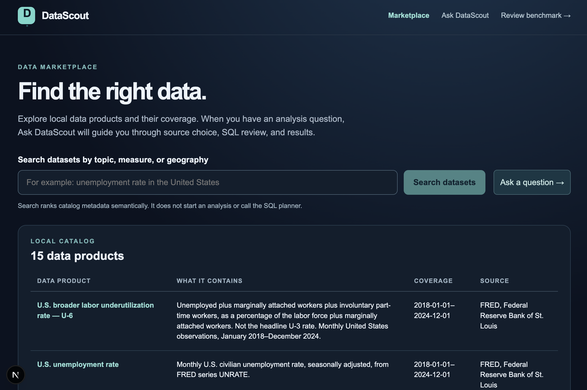
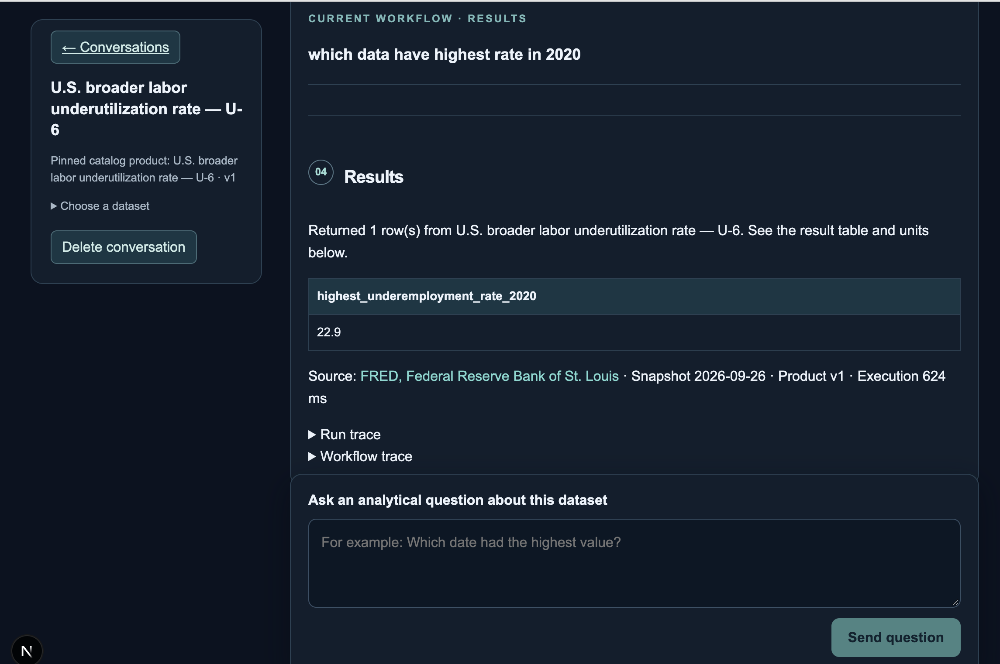
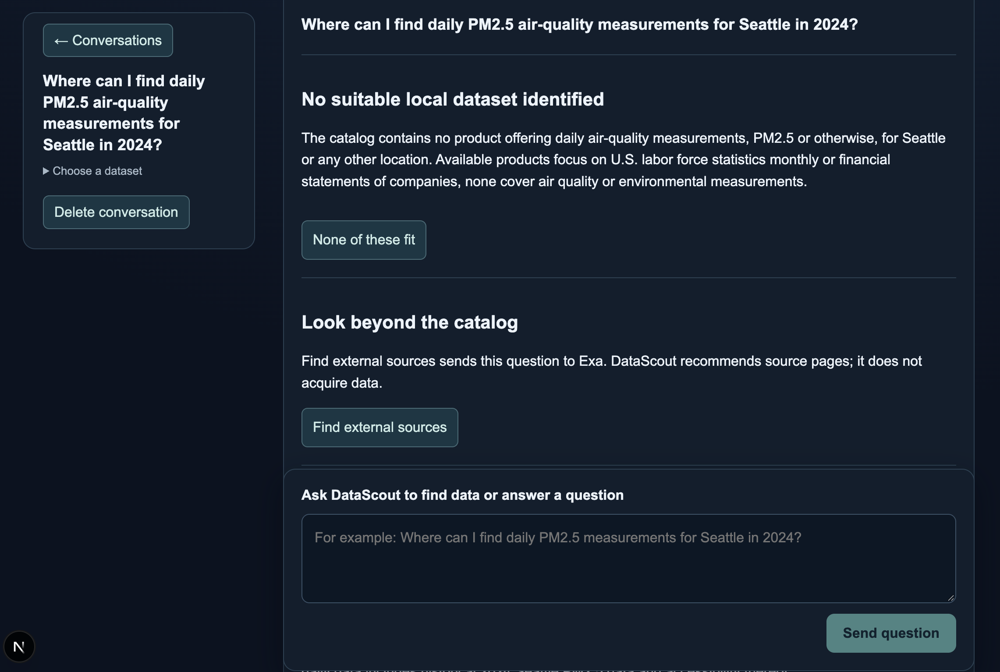

# DataScout

DataScout is a local demo of a data analyst that first helps users choose the
right dataset, then generates bounded SQL only after a human confirms the source.

The app has two clean paths:

- Analyze one of the 15 existing local catalog products with reviewed SQL and
  DuckDB execution.
- Find an evidence-backed external data source with Exa when the local catalog
  does not fit.

External discovery stops at source recommendation. DataScout does not download,
ingest, query, or register external data in this demo.

## Screenshots

### Data Marketplace



### Dataset-Bounded Conversation





### SQL Review

## High-Level Architecture

```text
Browser / Next.js UI
        |
        | Next.js API proxy
        v
Python FastAPI backend
        |
        +-- Catalog + manifests
        +-- Source Advisor
        +-- LangGraph workflow checkpoints
        +-- SQL planner + saved SQL approvals
        +-- DuckDB execution over local Parquet
        +-- Exa-backed external source discovery
        |
        +-- Local SQLite state
        +-- SingleStore metadata vectors
```

The core workflow is:

```text
Question
  -> recommend local datasets or external discovery
  -> user reviews a dataset
  -> user confirms the source
  -> SQL planner proposes bounded single-table SQL
  -> user approves SQL
  -> DuckDB executes against a local immutable snapshot
  -> result, SQL, trace, and provenance are saved in the conversation
```

### Main Components

| Component       | Responsibility                                                                          |
| --------------- | --------------------------------------------------------------------------------------- |
| Next.js app     | Marketplace, saved conversations, source review, SQL approval, result display           |
| FastAPI backend | Catalog, workflow, SQL, retrieval, conversations, benchmark review                      |
| LangGraph       | Coordinates source advice, human gates, SQL planning, execution, and external discovery |
| SQLite          | Local workflow checkpoints, conversations, SQL-plan approvals, review state             |
| DuckDB          | Executes approved SQL against local Parquet snapshots                                   |
| SingleStore     | Stores catalog metadata embeddings for semantic retrieval                               |
| OpenAI          | Embeddings, source advice, SQL planning, and external recommendation synthesis          |
| Exa             | External source discovery when the local catalog cannot answer                          |

## Tech Stack

- Frontend: Next.js, TypeScript, React
- Backend: Python, FastAPI
- Workflow orchestration: LangGraph with local SQLite checkpoints
- Local analytics: DuckDB over Parquet
- Vector search: SingleStore
- LLM calls: OpenAI Responses API
- Search provider: Exa
- Tests: pytest, Node test runner, TypeScript checks, Next production build

## What You Can Do

### Browse the Data Marketplace

Open the marketplace to search and compare the local catalog. The catalog
currently has 15 overlapping products across FRED, World Bank, Apple SEC, and
Microsoft SEC snapshots.

Semantic search helps users discover likely products, but search alone never
generates SQL or executes anything.

### Ask DataScout to Find a Dataset

Start a saved conversation from `/analyze` or the marketplace. A general question
can trigger source advice across all local products.

Example:

```text
What was the U.S. unemployment rate in April 2020?
```

DataScout recommends local products with reasons, coverage, units, caveats, and
provenance. The user must review and confirm one dataset before SQL planning.

### Ask Questions About a Confirmed Dataset

Once a dataset is confirmed, each analytical turn is planned separately.

DataScout shows:

- the interpreted question
- generated SQL
- selected fields and assumptions
- units and caveats
- execution trace
- result table

Every turn requires fresh SQL approval before execution.

### Find External Sources

If the local catalog does not fit, the user can explicitly choose external
discovery.

Example:

```text
Where can I find daily PM2.5 air-quality measurements for Seattle in 2024?
```

DataScout sends the question to Exa, reviews bounded search evidence with a
model, and returns a source recommendation, alternatives, original links, and
unknowns. These external sources are not queryable in the app.

### Review Benchmark Labels

Open `/benchmark-review` to review dataset-choice benchmark cases. This is a
human-in-the-loop review tool for source-selection quality, not a numerical
answer benchmark.

## Local Catalog

| Family        | Products                                                                                                                 | Snapshot coverage                                                       |
| ------------- | ------------------------------------------------------------------------------------------------------------------------ | ----------------------------------------------------------------------- |
| FRED          | Adjusted U-3, unadjusted U-3, unemployment count, adjusted U-6                                                           | Monthly 2018-2024                                                       |
| World Bank    | U.S. nominal per-capita GDP, total nominal GDP, real per-capita GDP, PPP per-capita GDP; Canadian nominal per-capita GDP | Annual 2015-2024                                                        |
| Apple SEC     | Annual income, cash flow, balance sheet; Q3 income                                                                       | Income/cash flow FY2022-FY2024; balance FY2023-FY2024; Q3 FY2023/FY2024 |
| Microsoft SEC | Annual income and cash flow                                                                                              | FY2022-FY2024                                                           |

Snapshots are local Parquet files with reviewed manifests. SEC facts come from
pinned filings, not live latest-filing lookup. User questions do not call FRED,
World Bank, SEC, or external provider APIs at execution time.

## Boundaries

DataScout currently supports:

- one confirmed local product per analytical question
- one registered table per SQL query
- lookups, ordered time series, aggregates, comparisons, and ratios
- human confirmation before source use
- human approval before SQL execution
- saved local conversations
- external source finding with consent

DataScout currently does not support:

- multi-product joins
- automatic source selection without human review
- automatic SQL execution
- external data ingestion
- numerical answers from web snippets
- downloading or registering discovered external datasets
- production authentication or multi-user deployment

## Run Locally

Requires Python 3.12+, Node.js 20+, and npm.

```bash
python3 -m venv .venv
.venv/bin/pip install -r requirements.txt
npm install
PYTHONPATH=python .venv/bin/uvicorn datascout.main:app --reload --port 8000
```

In another terminal:

```bash
npm run dev
```

Open `http://localhost:3000`.

Set `DATASCOUT_API_URL` if the Python API is running somewhere other than
`http://127.0.0.1:8000`.

## Configuration

Create a local `.env` file. It is ignored by git.

```bash
OPENAI_API_KEY=...
DATASCOUT_SQL_MODEL=gpt-4.1-mini
DATASCOUT_SOURCE_ADVISOR_MODEL=gpt-4.1-mini
DATASCOUT_EXTERNAL_ADVISOR_MODEL=gpt-4.1-mini
EXA_API_KEY=...

SINGLESTORE_HOST=...
SINGLESTORE_PORT=3333
SINGLESTORE_USER=...
SINGLESTORE_PASSWORD=...
SINGLESTORE_DATABASE=datascout
SINGLESTORE_SSL_CA=singlestore_bundle.pem
```

`EXA_API_KEY` is only required for external discovery. SingleStore is used for
semantic metadata retrieval and evaluation; the full-catalog source advisor can
assess local products without SingleStore.

Check the SingleStore connection:

```bash
PYTHONPATH=python .venv/bin/python -m datascout.singlestore check
```

Build or refresh metadata embeddings:

```bash
PYTHONPATH=python .venv/bin/python -m datascout.retrieval setup
PYTHONPATH=python .venv/bin/python -m datascout.retrieval ingest
PYTHONPATH=python .venv/bin/python -m datascout.retrieval search --question "What was U.S. GDP per capita in 2020?"
```

## Ingestion

The demo catalog is driven by reviewed YAML recipes in `data/recipes/` and
published manifests in `data/manifests/`.

The ingestion pipeline supports reviewed CSV, REST/JSON, and SEC/XBRL recipes.
It writes immutable Parquet snapshots and preserves source/provenance metadata.
Adding a recipe can add catalog metadata, but it does not automatically make a
new dataset answerable by the SQL workflow.

Useful commands:

```bash
PYTHONPATH=python .venv/bin/python -m datascout.ingestion list
PYTHONPATH=python .venv/bin/python -m datascout.ingestion plan fred_unemployment
PYTHONPATH=python .venv/bin/python -m datascout.ingestion build fred_unemployment --download
PYTHONPATH=python .venv/bin/python -m datascout.ingestion build fred_unemployment --download --publish --index
```

See [docs/ingestion.md](docs/ingestion.md) for recipe fields and ingestion
safety boundaries.

## Verification

Run the main checks:

```bash
PYTHONPATH=python .venv/bin/python -m pytest -q
npm test
npm run typecheck
npm run build
```

Run retrieval benchmark checks:

```bash
PYTHONPATH=python .venv/bin/python -m evals.expanded --validate-only
PYTHONPATH=python .venv/bin/python -m evals.expanded --split development --output evals/results/NEW_REPORT_NAME.json
```

Run source-advisor development evaluation:

```bash
PYTHONPATH=python .venv/bin/python -m evals.source_advisor
PYTHONPATH=python .venv/bin/python -m evals.source_advisor --live --output evals/results/NEW_ADVISOR_REPORT.json
```

Run SQL smoke evaluation:

```bash
PYTHONPATH=python .venv/bin/python -m evals.sql_execution --output evals/results/NEW_SQL_REPORT.json
```

Live eval commands may call configured model providers. Ordinary tests use mocks
and should not require live credentials.

## Local State

DataScout stores development state under `.local/`:

- workflow checkpoints and saved conversations
- saved SQL-plan approvals
- benchmark-review feedback
- SingleStore-independent local state

These files are ignored by git. Deleting them resets local app state but does not
delete the committed catalog snapshots.

## Project Status

This is a single-user local demo. It is designed to make dataset choice,
metadata quality, SQL review, and human approval visible. Before public or
multi-user deployment, add authentication, production storage, background worker
management, audit controls, and a real ingestion workflow for discovered sources.
